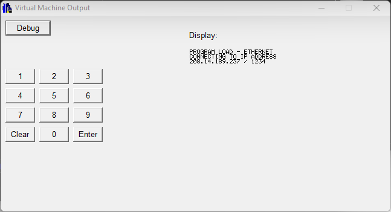
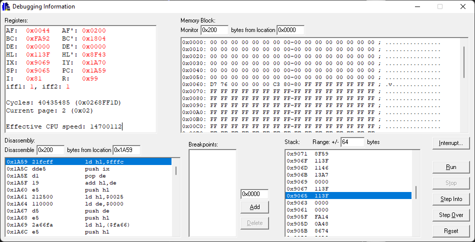

## Z80 CPU emulator / Hypercom ICE 6000 Emulator

This was a personal project that I did circa 2002 while working for a small point-of-sale software shop.
File timestamps on the old disk that I found it on range from 29 May 2002 to 6 August 2002.

### History

We wrote processing software to route transactions to various credit card processors, as well as custom
software that ran on a variety of credit card terminals.

Most of the terminals of the day were very simple things: simple LCD screens, or maybe monochrome dot-
matrix screens. Software development was typically some form of custom "terminal control language" or
embedded C.

Along comes [Hypercom][1] with the [ICE6000][2], a vastly overpowered (by early-2000s standards)
credit and smart-card terminal, that sported a 320 x 200 VGA screen and TCP/IP-capable 10-Base-T ethernet.
It was a beast of a terminal. And we had a client that wanted to make use of it.

I was sent to a training course in Arizona to learn about it. The machine was powered by a Z80 CPU running
at 14.7 MHz and had a custom multi-processing OS. Since the Z80 was an 8-bit CPU that could only address
64K of RAM, the hardware implemented a paging system by which the upper 32K of RAM was always present and
stored ephemeral data (i.e. stacks) and the lower 32K of RAM could be swapped between ROM pages and software
pages. This meant that when you developed software for it, you had to be cognizant of which pages contained
which program code, and you could call OS functions to swap pages (or, if memory serves, to call functions
in other pages, but without passing any parameters).

As a kid in my early 20s, this was fascinating. I took apart one of the terminals and wrote down all of the
chips that it was using, then I found white pages about the chips online. I started implementing a "simulator"
(today we'd call it an emulator) that could run the software as if it was the terminal hardware. But there
was a problem--I didn't have the ROM for the device.

Since the terminal supported TCP/IP over 10-Base-T ethernet, I wrote two quick little utilities that have
been lost to time: one that would run on the terminal, read the pages and send the raw data out a socket;
and one that would run on my PC and write the data received from the socket out to a file. This allowed
me to get access to the custom OS in binary form and start reverse engineering it.

### Will it build/run?

Building the simulator from source is likely very difficult at this point. I believe it was based around
Borland C++ 4.0 or 4.5 and targeted probably Windows 2000 or Windows XP. Borland had their own windowing
system that was very different from MFC or whatever the standards were of the day. However, an old hard
drive still had a built executable, and amazingly it runs on Windows 11! This allows me to show some
visuals about how it worked.

The VM had a simple page with the display output and they keypad that was on the terminal. The display
emulation is based on whatever chip the [ICE6000][2] used as a display driver, and this screenshot is
displaying the built-in font stored in the OS pages. I reckon the pages that the simulator is running have the
upload utility mentioned above, as it is trying to connect to an IP; or perhaps it is the built-in software
loader trying to download software to run from a PC.

Pressing the Debug button though is where all the magic happens. This produces a debug window that allows a
developer to debug what the machine is doing at the machine code level.

The 'Registers' panel displays the current value of the CPU registers, as well as how many clock cycles
have elapsed, and how fast the CPU is running. The current memory page is also displayed. The 'Disassembly'
panel allows inspecting any memory address and displaying the instruction bytes stored there. The current
Program Counter is highlighted. The 'Memory Block' panel allows inspecting any memory address in the
currently loaded pages. Breakpoints can also be added, and memory words around the current stack address as well.
The CPU emulation also supports single-stepping and stepping over function calls.

### Is it finished?

Nope, nor will it ever be. It was a fun project to keep me entertained back in a day where the work I was doing
was just that--work. It wasn't fun, and I wasn't super passionate about it. But I loved (and still love)
programming, and these types of projects were how I kept myself happy.

### Code Notes

This is shared for historical purposes only. If any portions of it are actually useful, please use them freely
with attribution. I'm not making any attempts to clean up the code, and looking back on some of it (especially
the formatting/spacing) is pretty horrific.

Enjoy!

Joshua Kriegshauser

* [1]: https://en.wikipedia.org/wiki/Hypercom "Hypercom"
* [2]: https://www.posnetwork.net/hypercom-ice-6000/ "ICE 6000"
